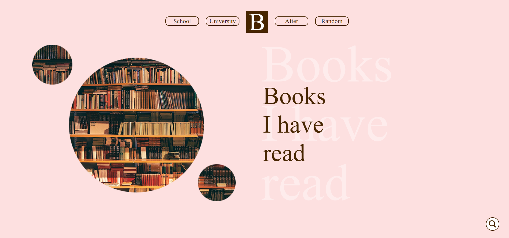
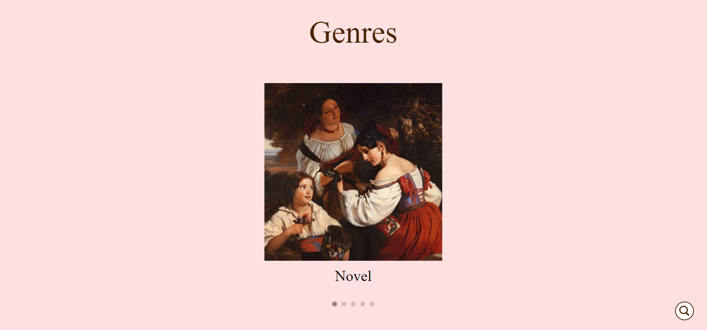
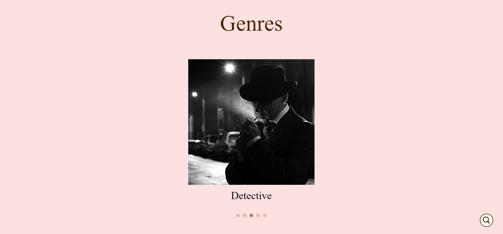
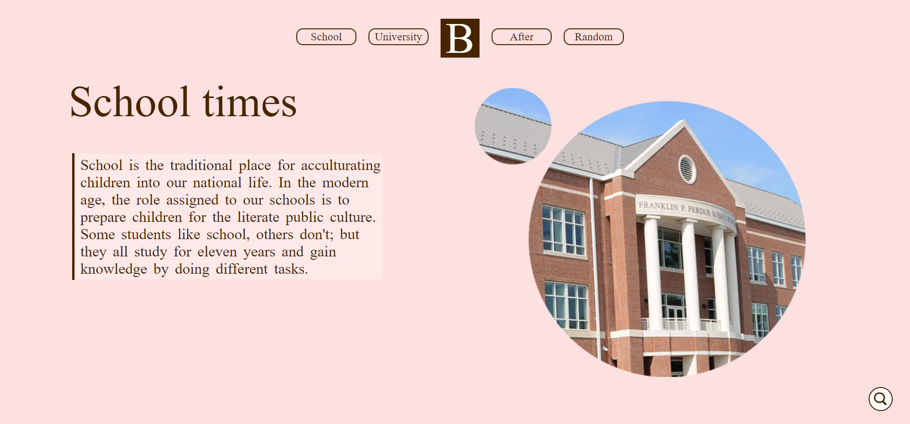
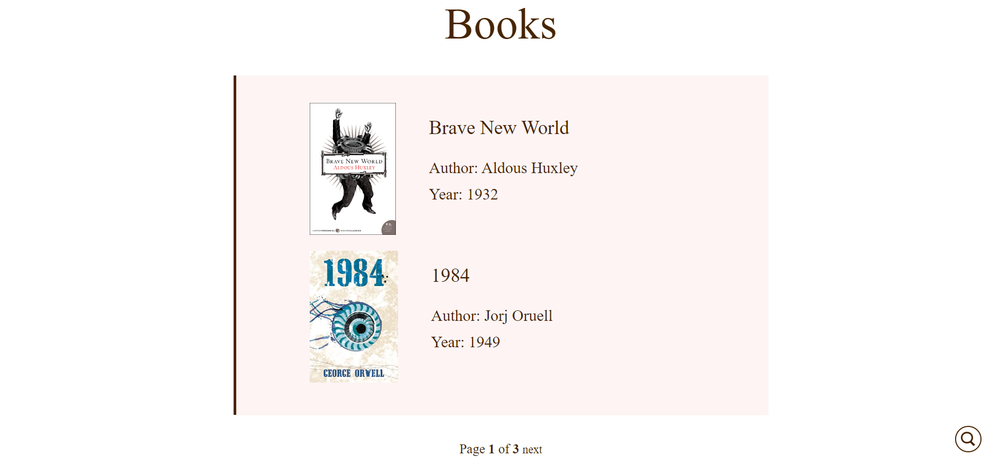
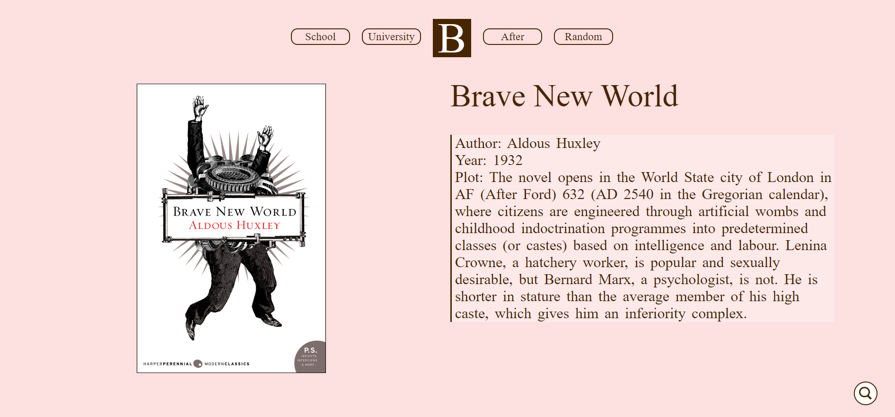
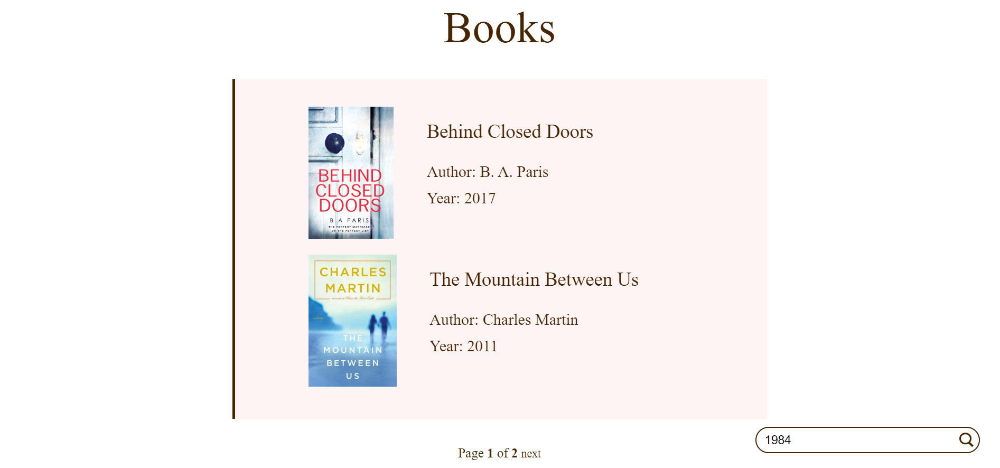
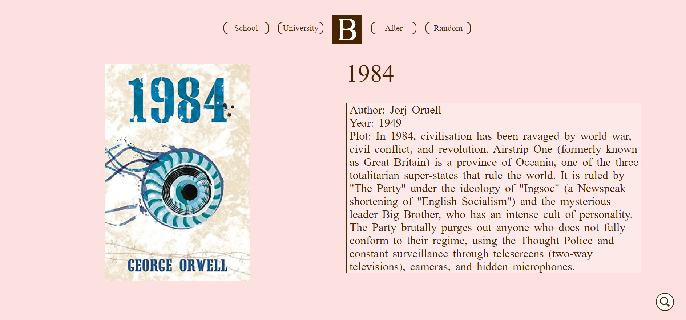

# django-book-site

### Introduction
This project is about books I have read through my life. It is made using Django/PostgreSQL/HTML/CSS/JS/Ajax.

### Home page
So, the first page consists of introduction block, my interests block, genres of books block and contact block. 

Here is how first block of Home page looks like:

 

Genres block contains carousel, so you can see different genres of books that inroduced on the website. 

  
 

### School/University/After pages
School/University/After pages consist of introduction block and books list with pagionation. Pagination is made using AJAX. 

Introduction school block:

 

Ater books list: 

 

By clicking on book's image or name, you will be redirected to book's details page:

 

### Random page
Random page is the book's details page for random book from database.

### Search

On every page, in the lower right corner you can see search icon. You can click on it, type book name that you are interested in and press ENTER button on your keyboard to get the book's details page.
 

 

Search result:

 